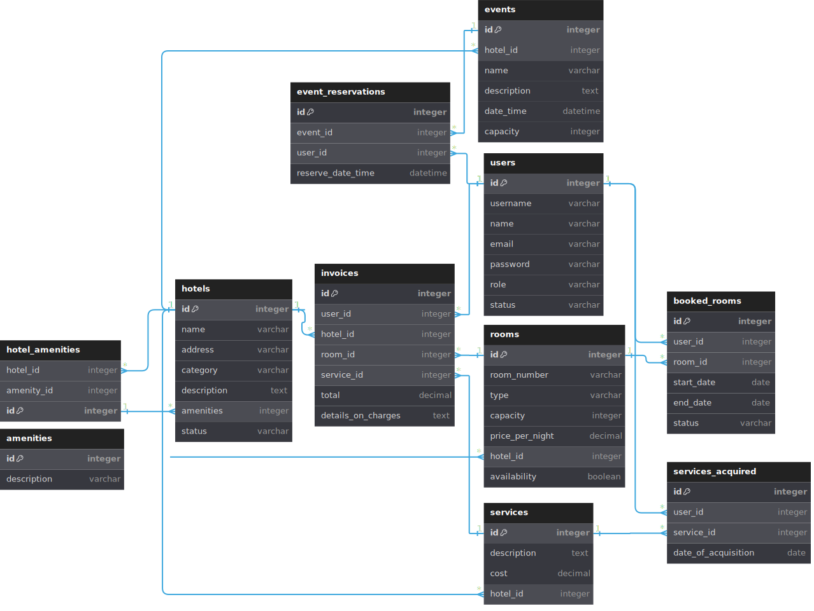

# Kinalgo Backend (In Development)

## Important

Hey devs its your scrum here! i will be deploying util information and docs for the project development, remember check the sprint calendar so you can see what we are gonna be working trough the weeks, please remember to attend the sprint reviews, they are every Wednesday, Friday and Sunday at 9:00 P.M. and also remember checking the Trello Dashboard for the task distribution, good luck :D

- [Trello Dashboard](https://trello.com/b/9fLHUcu3/equipo-2)
- [Sprint Calendar](./src/common/assets/Kinalgo_Sprint_Calendar.pdf)

## Feature Branches

`feature/hotel_management`

- **Purpose**: Implement and refine the functionality related to managing hotel data within the system.
- **Scope of Work**: Creating hotel profiles, updating hotel information, managing hotel amenities, and handling room details. This may include database operations, API endpoints, and integration with the front-end for displaying hotel information.

`feature/event_management`

- **Purpose**: Develop the features necessary for creating, updating, and displaying events hosted by the hotels.
- **Scope of Work**: Event creation forms, event editing capabilities, displaying upcoming events, and linking events with hotels and users. Includes server-side logic for event time scheduling and conflict avoidance.

`feature/service_management`

- **Purpose**: Build out the services offered by hotels, such as spa treatments, room service, and other amenities.
- **Scope of Work**: Defining service models, creating service-related API endpoints, business logic for service booking and cancellation, and administrative functions for hotel staff to manage services.

`feature/user_accounts`

- **Purpose**: Handle everything related to user account creation, management, and user profiles.
- **Scope of Work**: User registration, profile editing, password management, role assignments, and potentially user-related analytics. Will also include authentication and authorization services.

`feature/authentication`

- **Purpose**: Secure the application by implementing authentication and authorization mechanisms.
- **Scope of Work**: Login/logout processes, JWT token management, OAuth integration, session management, and security middleware development.

`feature/invoice_management`

- **Purpose**: Manage the generation, updating, and retrieval of invoices for services rendered and bookings made.
- **Scope of Work**: Automated invoice creation upon booking confirmation, invoice editing capabilities, payment status tracking, and historical invoice retrieval for both users and admins.

## Database Schema

